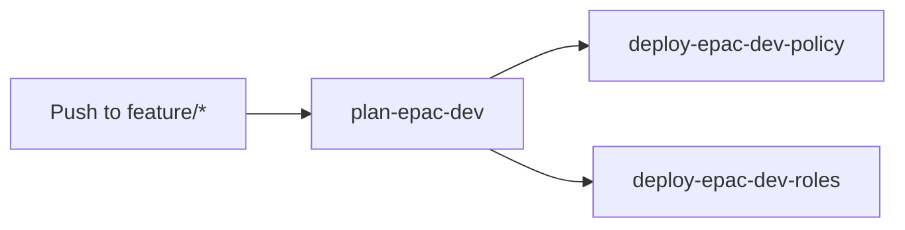
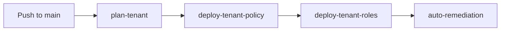

# GitLab CI/CD Setup for EPAC

This guide walks you through setting up GitLab CI/CD pipelines for Enterprise Policy as Code (EPAC) deployment using OIDC authentication.

## Prerequisites

- GitLab account with a project/repository
- Azure subscription with appropriate permissions
- Azure CLI installed locally
- PowerShell 7+ installed

## Architecture

The GitLab pipeline uses **OpenID Connect (OIDC)** to authenticate to Azure without storing secrets. The pipeline has 4 stages:

1. **plan-dev** - Plans and deploys to development environment (feature branches)
2. **plan-tenant** - Plans deployment to production (main branch)
3. **deploy-tenant-policy** - Deploys policies to production (manual approval required)
4. **deploy-tenant-roles** - Deploys role assignments to production (manual approval required)

## Step 1: Create Azure Service Principal

Create a service principal for GitLab OIDC authentication:

```bash
# Set variables
SUBSCRIPTION_ID="<YOUR_SUBSCRIPTION_ID>"
TENANT_ID="<YOUR_TENANT_ID>"
SERVICE_PRINCIPAL_NAME="gitlab-epac-oidc"

# Create service principal
az ad sp create-for-rbac --name $SERVICE_PRINCIPAL_NAME --role Contributor --scopes /subscriptions/$SUBSCRIPTION_ID

# Save the output - you'll need the appId (client ID)
```

**Important:** Save the `appId` from the output. This is your `AZURE_CLIENT_ID`.

## Step 2: Assign Required Azure Roles

The service principal needs these roles at the **Tenant Root Management Group** level:

```bash
# Get your tenant root management group ID (usually same as tenant ID)
TENANT_ROOT_MG="<YOUR_TENANT_ROOT_MG_ID>"

# Get service principal object ID
SP_OBJECT_ID=$(az ad sp list --display-name $SERVICE_PRINCIPAL_NAME --query "[0].id" -o tsv)

# Assign required roles
az role assignment create \
  --assignee $SP_OBJECT_ID \
  --role "Reader" \
  --scope "/providers/Microsoft.Management/managementGroups/$TENANT_ROOT_MG"

az role assignment create \
  --assignee $SP_OBJECT_ID \
  --role "Resource Policy Contributor" \
  --scope "/providers/Microsoft.Management/managementGroups/$TENANT_ROOT_MG"

az role assignment create \
  --assignee $SP_OBJECT_ID \
  --role "Role Based Access Control Administrator" \
  --scope "/providers/Microsoft.Management/managementGroups/$TENANT_ROOT_MG"
```

## Step 3: Configure OIDC Federated Credentials

Create federated credentials for each GitLab environment:

```bash
# Get your GitLab project path (e.g., "mygroup/myproject")
GITLAB_PROJECT_PATH="<YOUR_GITLAB_GROUP>/<YOUR_GITLAB_PROJECT>"
APP_ID="<YOUR_AZURE_CLIENT_ID>"

# Create federated credential for epac-dev environment
az ad app federated-credential create \
  --id $APP_ID \
  --parameters '{
    "name": "gitlab-epac-dev",
    "issuer": "https://gitlab.com",
    "subject": "project_path:'"$GITLAB_PROJECT_PATH"':ref_type:branch:ref:feature/*",
    "description": "GitLab OIDC for EPAC Dev environment",
    "audiences": ["https://gitlab.com"]
  }'

# Create federated credential for tenant-plan environment
az ad app federated-credential create \
  --id $APP_ID \
  --parameters '{
    "name": "gitlab-tenant-plan",
    "issuer": "https://gitlab.com",
    "subject": "project_path:'"$GITLAB_PROJECT_PATH"':ref_type:branch:ref:main",
    "description": "GitLab OIDC for Tenant Plan environment",
    "audiences": ["https://gitlab.com"]
  }'

# Create federated credential for tenant-deploy-policy environment
az ad app federated-credential create \
  --id $APP_ID \
  --parameters '{
    "name": "gitlab-tenant-deploy-policy",
    "issuer": "https://gitlab.com",
    "subject": "project_path:'"$GITLAB_PROJECT_PATH"':ref_type:branch:ref:main",
    "description": "GitLab OIDC for Tenant Deploy Policy environment",
    "audiences": ["https://gitlab.com"]
  }'

# Create federated credential for tenant-deploy-roles environment
az ad app federated-credential create \
  --id $APP_ID \
  --parameters '{
    "name": "gitlab-tenant-deploy-roles",
    "issuer": "https://gitlab.com",
    "subject": "project_path:'"$GITLAB_PROJECT_PATH"':ref_type:branch:ref:main",
    "description": "GitLab OIDC for Tenant Deploy Roles environment",
    "audiences": ["https://gitlab.com"]
  }'
```

## Step 4: Configure GitLab CI/CD Variables

In your GitLab project, go to **Settings → CI/CD → Variables** and add:

### Required Variables

| Variable Name | Value | Protected | Masked | Description |
|--------------|-------|-----------|---------|-------------|
| `AZURE_CLIENT_ID` | `<Your App ID>` | ✅ Yes | ✅ Yes | Azure Service Principal Application ID |
| `AZURE_TENANT_ID` | `<Your Tenant ID>` | ✅ Yes | ✅ Yes | Azure Tenant ID |

### Optional Variables

| Variable Name | Value | Description |
|--------------|-------|-------------|
| `ENABLE_AUTO_REMEDIATION` | `true` or `false` | Enable automatic remediation after policy deployment |

**Important:** Mark variables as "Protected" to only expose them on protected branches (main).

## Step 5: Configure GitLab Environments

Create the following environments in **Deployments → Environments**:

1. **epac-dev** - Development environment (auto-deploys on feature branches)
2. **tenant-plan** - Production planning (runs on main branch)
3. **tenant-deploy-policy** - Policy deployment (requires manual approval)
4. **tenant-deploy-roles** - Role deployment (requires manual approval)

### Setting up Protected Environments

For production environments, configure protection rules:

1. Go to **Settings → CI/CD → Protected Environments**
2. Add protection for:
   - `tenant-deploy-policy` - Require approval from specific users/groups
   - `tenant-deploy-roles` - Require approval from specific users/groups

## Step 6: Update EPAC Configuration

Update `Definitions/global-settings.jsonc` with your Azure tenant and management group IDs:

```jsonc
{
  "pacOwnerId": "<YOUR_PAC_OWNER_ID>",
  "pacEnvironments": [
    {
      "pacSelector": "epac-dev",
      "cloud": "AzureCloud",
      "tenantId": "<YOUR_TENANT_ID>",
      "deploymentRootScope": "/providers/Microsoft.Management/managementGroups/<YOUR_TENANT_ROOT_MG_ID>",
      "desiredState": {
        "strategy": "ownedOnly"
      },
      "managedIdentityLocation": "eastus"
    },
    {
      "pacSelector": "tenant",
      "cloud": "AzureCloud",
      "tenantId": "<YOUR_TENANT_ID>",
      "deploymentRootScope": "/providers/Microsoft.Management/managementGroups/<YOUR_TENANT_ROOT_MG_ID>",
      "desiredState": {
        "strategy": "full"
      },
      "managedIdentityLocation": "eastus"
    }
  ]
}
```

## Step 7: Test the Pipeline

1. **Test Dev Environment:**
   ```bash
   git checkout -b feature/test-pipeline
   # Make a small change to Definitions/
   git add .
   git commit -m "test: verify pipeline"
   git push origin feature/test-pipeline
   ```

2. **Check GitLab Pipeline:**
   - Go to **CI/CD → Pipelines**
   - Verify the `plan-epac-dev` job runs successfully
   - Check that it authenticates to Azure and builds the plan

3. **Test Production Deployment:**
   ```bash
   git checkout main
   git merge feature/test-pipeline
   git push origin main
   ```

4. **Approve Production Deployment:**
   - Pipeline will run `plan-tenant` automatically
   - Review the plan in the job artifacts
   - Manually approve `deploy-tenant-policy` job
   - After policy deployment, approve `deploy-tenant-roles` job

## Pipeline Workflow

### Development (Feature Branches)



- Automatically plans and deploys to dev environment
- No manual approval required
- Used for testing policy changes

### Production (Main Branch)



- `plan-tenant`: Automatically creates deployment plan
- `deploy-tenant-policy`: **Requires manual approval** - Deploys policies
- `deploy-tenant-roles`: **Requires manual approval** - Deploys role assignments
- `auto-remediation`: (Optional) Automatically remediates non-compliant resources

## Troubleshooting

### Pipeline fails with "AADSTS700213: No matching federated identity record"

**Solution:** Verify federated credentials match your GitLab project path:
```bash
az ad app federated-credential list --id $APP_ID
```

The `subject` field must exactly match:
- Dev: `project_path:<group>/<project>:ref_type:branch:ref:feature/*`
- Main: `project_path:<group>/<project>:ref_type:branch:ref:main`

### Pipeline fails with "AccessDenied" when querying Azure

**Solution:** Ensure all three RBAC roles are assigned:
```bash
az role assignment list --assignee $SP_OBJECT_ID --scope "/providers/Microsoft.Management/managementGroups/$TENANT_ROOT_MG"
```

Wait 5-10 minutes for RBAC propagation.

### Jobs show "skipped" status

**Solution:** The pipeline only runs when `Definitions/**/*` files change. Make sure your changes include files in the Definitions folder.

## Migration from GitHub Actions

If migrating from GitHub Actions:

1. Keep both pipelines during transition period
2. Test GitLab pipeline on a separate branch first
3. Update federated credentials (GitLab uses different subject format)
4. Once verified, disable GitHub Actions workflows
5. Delete `.github/workflows/` directory

## Security Best Practices

1. ✅ Use OIDC instead of storing secrets
2. ✅ Mark CI/CD variables as "Protected" and "Masked"
3. ✅ Require manual approval for production deployments
4. ✅ Use protected branches (main) for production
5. ✅ Limit who can approve protected environment deployments
6. ✅ Review deployment plans before approving
7. ✅ Use least-privilege RBAC roles

## Additional Resources

- [GitLab CI/CD OIDC Documentation](https://docs.gitlab.com/ee/ci/cloud_services/azure/)
- [Azure Federated Identity Documentation](https://learn.microsoft.com/entra/workload-id/workload-identity-federation)
- [EPAC Documentation](https://aka.ms/epac)
- [NIST 800-53 Control Families](https://csrc.nist.gov/publications/detail/sp/800-53/rev-5/final)

## Support

For issues with:
- **Pipeline configuration**: Check GitLab CI/CD logs
- **Azure authentication**: Verify federated credentials and RBAC roles
- **Policy deployment**: Review EPAC deployment plans in artifacts
- **NIST compliance**: See `NIST-COMPLIANCE.md` for control mappings
